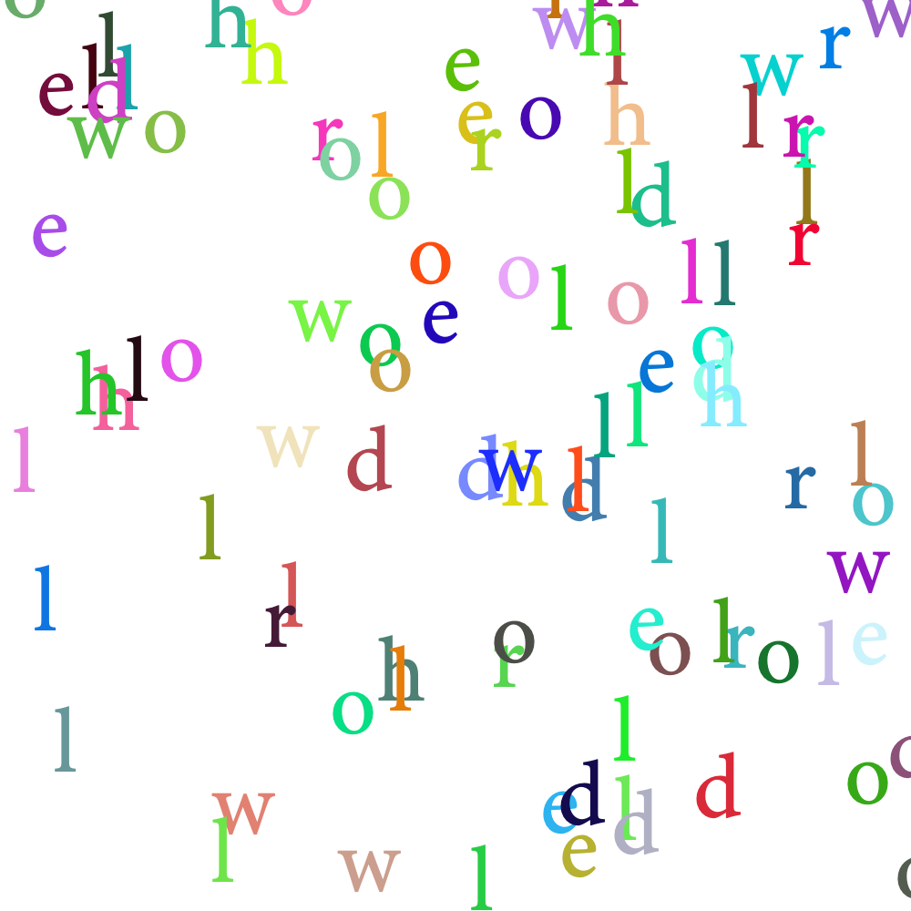
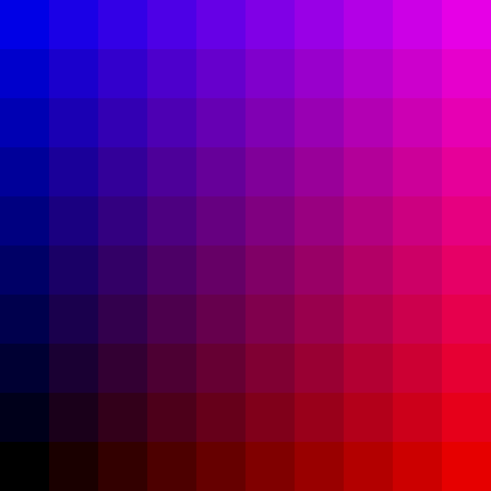

# Post Session 1 Challenges

Feel free to post your solutions/variations/happy accidents/whatever you make in #show-tell...would love to see what you’re working on! And feel free to request more/harder/easier challenges, and post about any speedbumps you encounter in #tech-support.

# Position two ovals to make a donut

[Possible solution](donut.py)

# Loop through hello world and draw each letter at a random position on the canvas

[Possible solution](randomPlacementLoop.py)

# Take the grid we made and turn it into a checkerboard

[Possible solution](checkerboard.py)

# Take the grid we made and augment the red, green, or blue values so you get a subtle gradation in color across the grid

[Possible solution](gridient.py)
