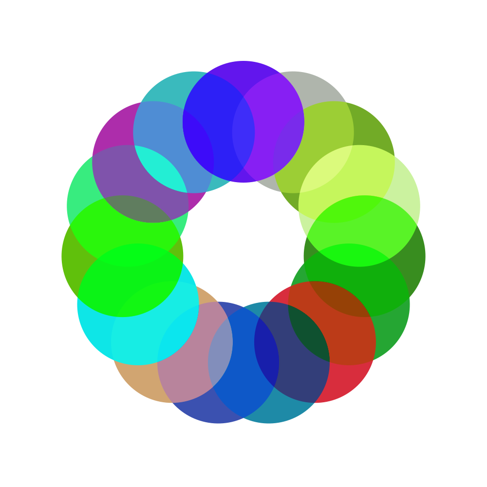
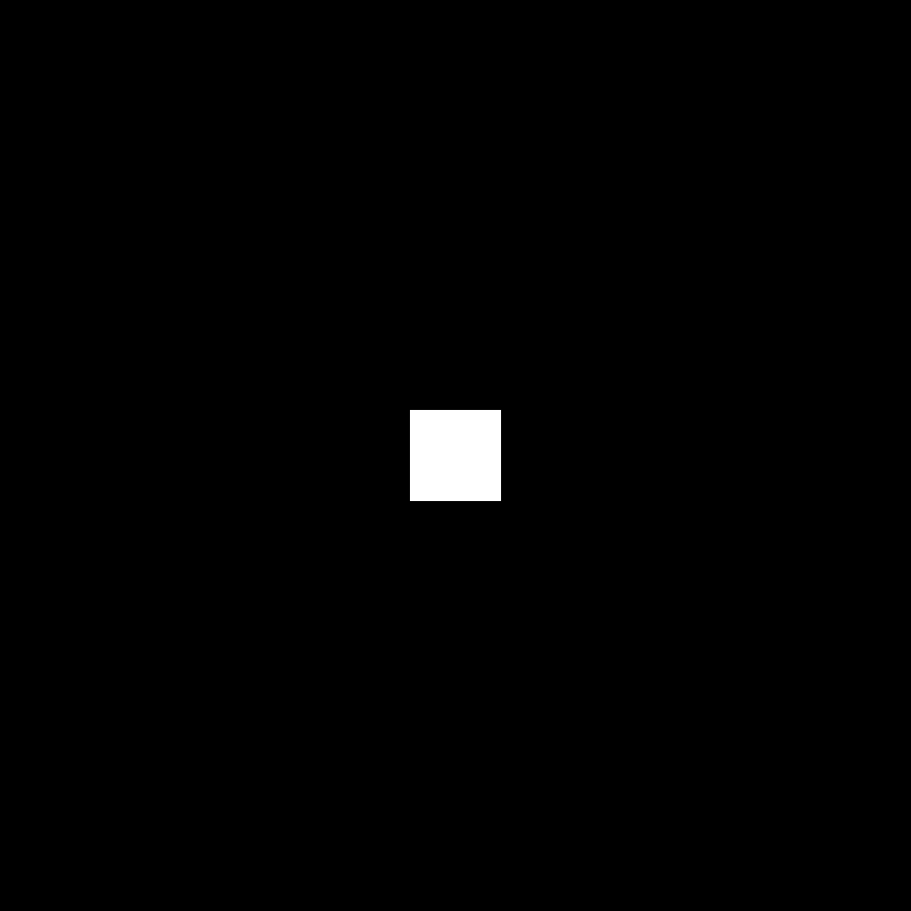
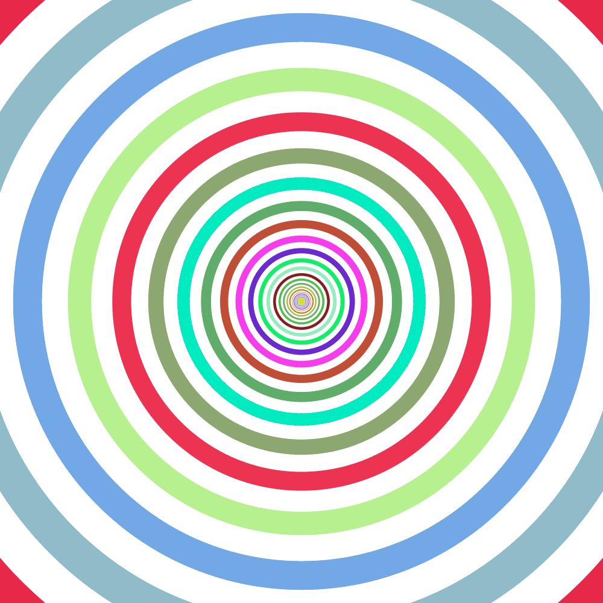
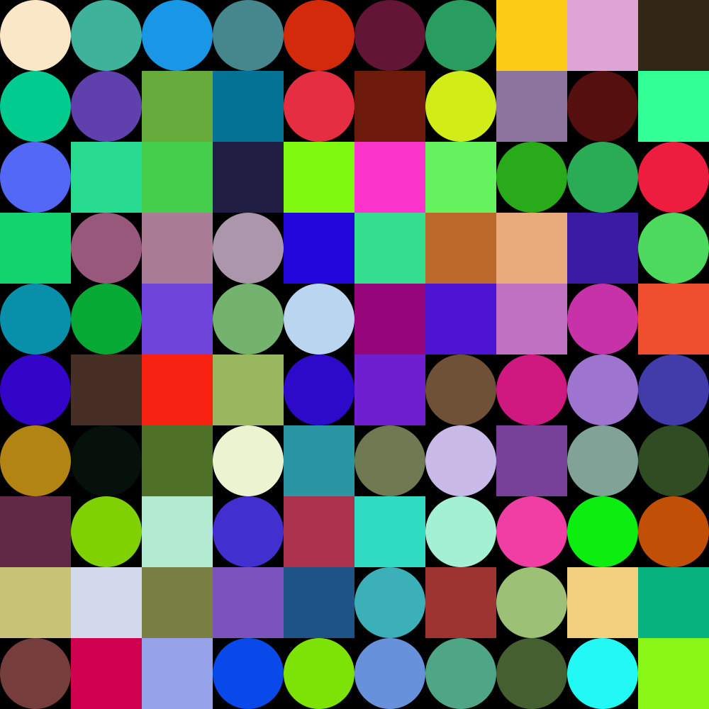
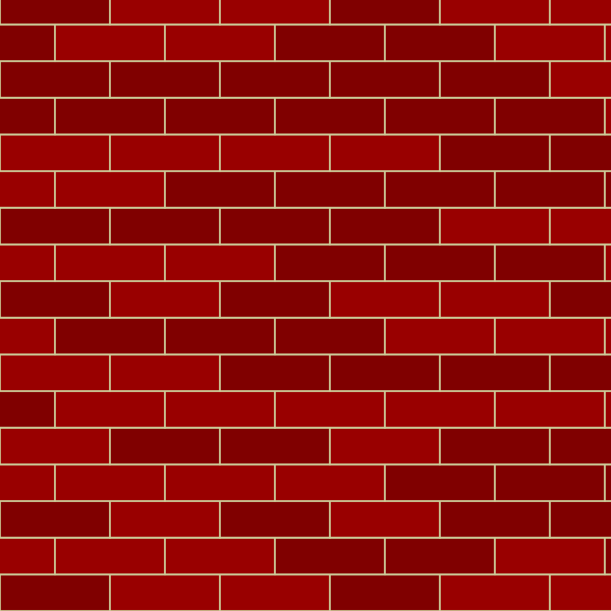

# Session 2 Challenges

Alright, some challenges for this week (Again you’re welcome work on whatever you want...these are just ideas!)

## Circle of Circles

Draw a ring of circles in the center of the canvas using `translate()` and `rotate()` (tip: my example uses random colors and `blendMode('overlay')` to make the overlaps visible)

## Scaling Square

Draw a scaling square in black and white (bonus points if you only use `rect()` once!)

## Concentric Shapes

Draw concentric circles that alternate between a random color and white

## Grid

A grid of shapes using translate() and savedState()  that randomly draws a rectangle or oval

## Bricks

Draw a brick wall.

