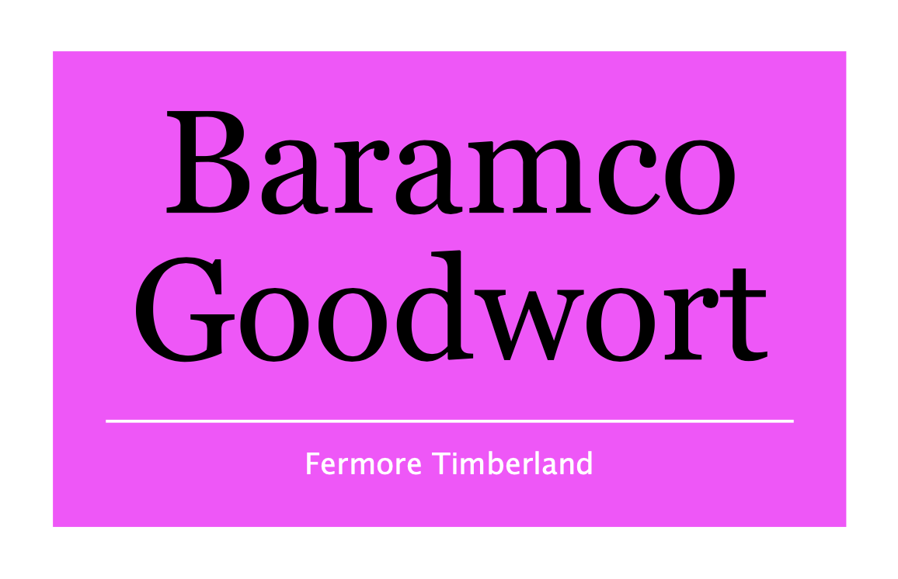
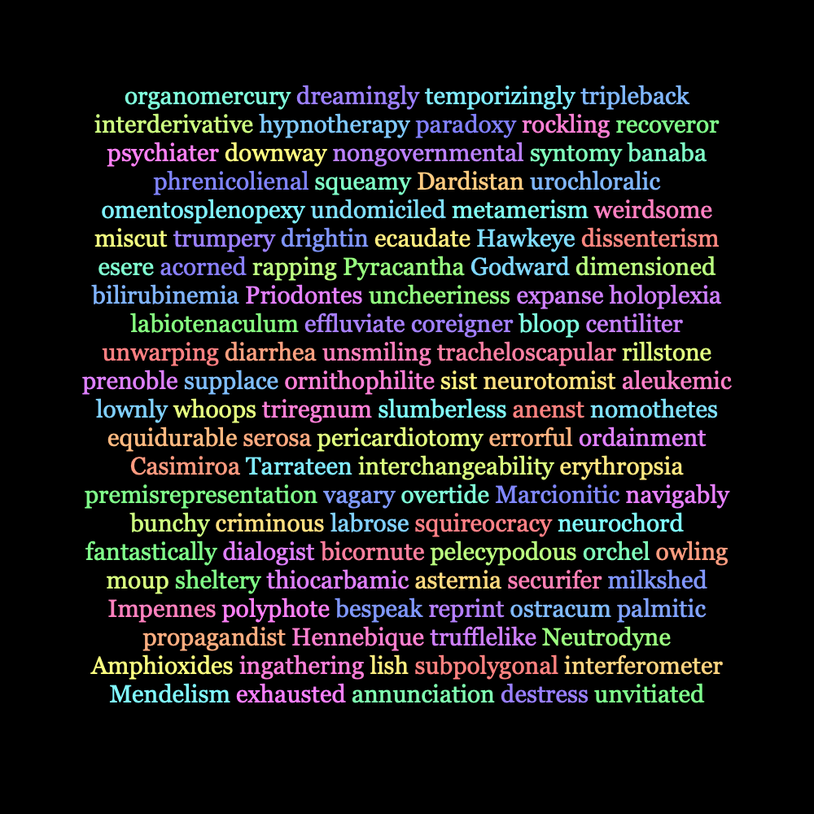

# Session 4 Challenges

# Business card

Finish designing a business card based on the spreadsheet.

Bonus: Take the business cards we made during class, turn that into a function. Then make a contact sheet that draws a grid of cards on the page.


## Rainbow

Make a rainbow by looping through a list of colors. Here’s the list I used:
```
myColorList = [
    (1, 0, 0), # red
    (1, .65, 0), # orange
    (1, 1, 0), # yellow
    (0, 1, 0), # green
    (93/255, 208/255, 1), # blue
    (50/255, 60/255, 190/255), # indigo
    (238/255, 130/255, 238/255), # violet,
    (1, 1, 1) # white
    ]
```


## Name badges

Try your hand at some name badges! I’ve included a CSV you can use, or you can make your own. Bonus points if you make the badge a different color based on their role (attendee, speaker, organizer, what have you)



## Random Word Generator

Make your own Lorem Ipsum generator using `FormattedString()`. You can use words from the Mac OS internal word list, which you can find at `/usr/share/dict/words` and the `shuffle()` function accessible via `from random import shuffle`.



## Random Bezier Paths

Create a `BezierPath()`, and add a bunch of randomly positioned curves with a loop (might be easier to start with straight lines, if you want). Then do this over a series of frames to animate the shape.


